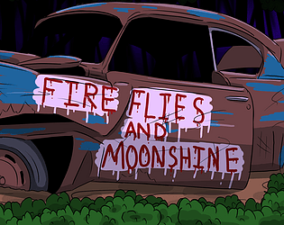

# Fireflies-And-Moonshine
A country fried love story.

**Fireflies and Moonshine** is a narrative-driven visual novel set in the Deep South, where a stranded traveler finds himself caught between small-town secrets and an unexpected connection with a charming, buck-toothed redneck girl who's every bit as eccentric as she is unforgettable.

> Developed over the course of a year and a half, this project is the culmination of solo work in both **art** and **programming**—from hand-drawn sprites and UI design to custom scripting, branching dialogue systems, and player-choice logic.

---

##  Play the Game

[**Play on itch.io**](https://quinnzilla-xd.itch.io/fireflies-and-moonshine)  
(*Free to play, no account required*)

---

##  Features

-  **Branching narrative paths** with multiple outcomes based on player choices  
-  **Dynamic dialogue system** built in Ren'Py  
-  **Hand-drawn character art** and custom UI elements  
-  **Southern Gothic tone** with hints of humor, romance, and mystery  
-  Fully scripted in **Python (Ren’Py)** with robust internal logic and tracking systems

---

## 👤 Solo Developer

**Everything was done entirely by me**, including:
- Writing, story structure, and dialogue
- Character art and visual assets
- Programming in Python/Ren'Py
- UI and game logic design

---

##  Screenshots

---

##  Tech Stack

- **Engine:** Ren'Py (Python-based Visual Novel engine)  
- **Languages:** Python, Ren’Py script  
- **Tools:** Visual Studio Code, Aseprite, Clip Studio Paint, GitHub

---

##  A Note from the Creator

This game was a labor of love and a major step in building my skills as a game developer. I made it to learn, grow, and share a story I truly care about. If you give it a play, I’d love to hear what you think.
